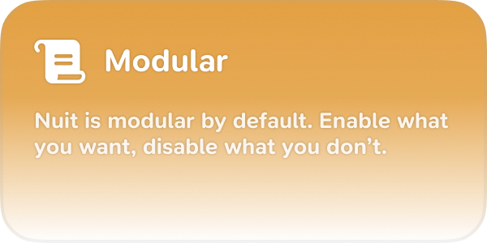
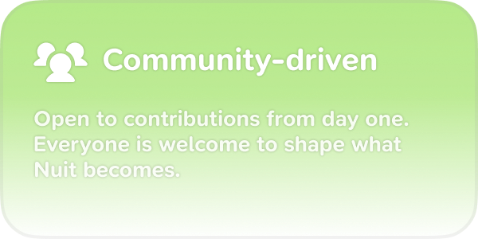
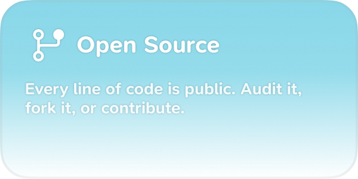
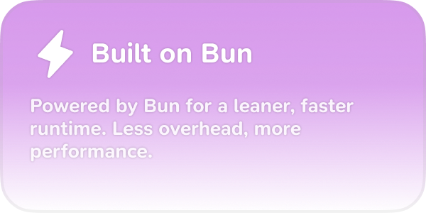

<h1>Nuit</h1>

The most customizable Discord bot that pretty much exists.

## Features

<table>
  <tr>
    <td></td>
    <td></td>
  </tr>
  <tr>
    <td></td>
    <td></td>
  </tr>
</table>

## Installation

See [SELFHOSTING.md](./SELFHOSTING.md).

## Contributing

We welcome contributions from the community. Please read our [contributing guidelines](./CONTRIBUTING.md) for more information on how to get involved with this project.

Note that we may take longer to review pull requests depending on their size - larger PRs require more time to properly evaluate.
